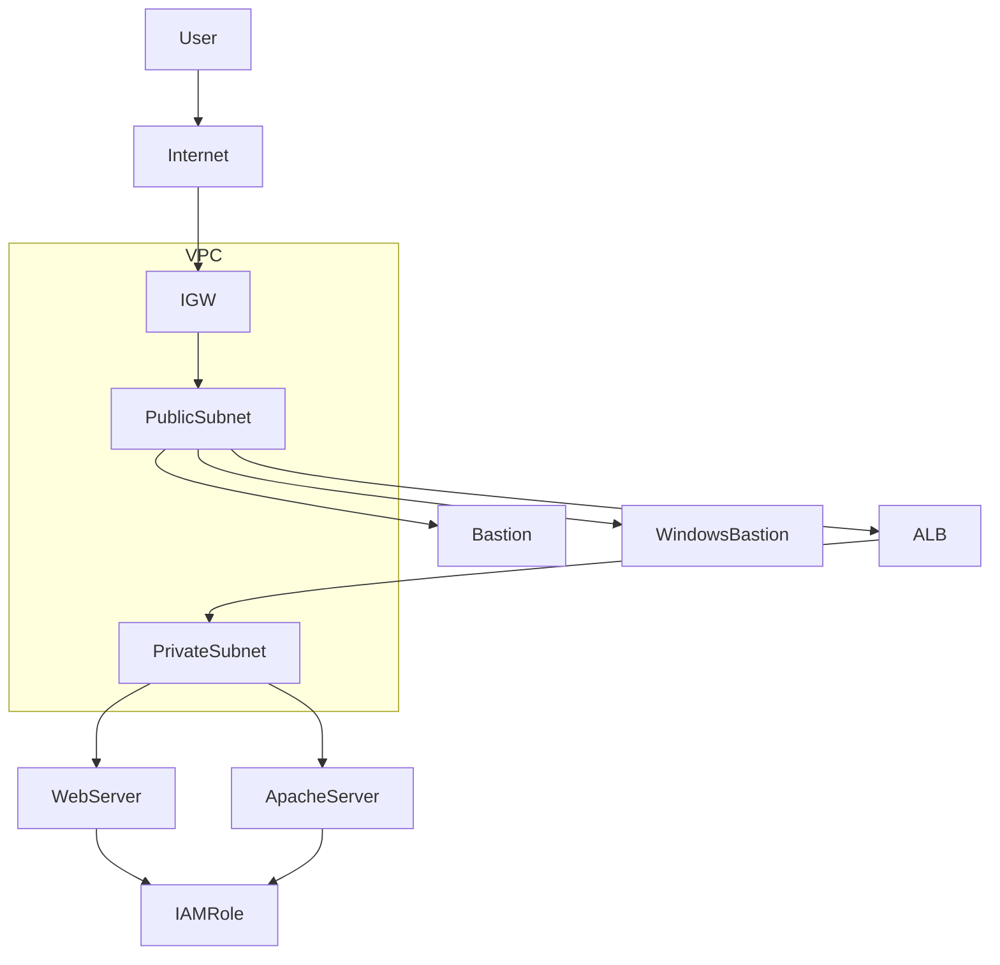
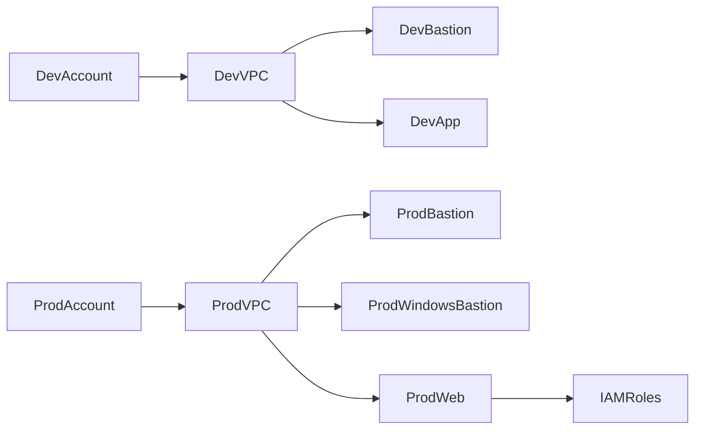

# 🚀 AWS Terraform Infrastructure  
## Dev & Production Environments (Enterprise-Ready)

---

# 📌 1. Project Overview

This repository provisions AWS infrastructure using **Terraform** for fully isolated **Development** and **Production** environments.

The architecture follows Infrastructure as Code (IaC) best practices with:

- Environment isolation (Dev / Prod)
- Modular infrastructure design
- Secure remote backend
- IAM least privilege access
- Bastion-based access model
- Private subnet workload isolation
- Scalable structure for future multi-account expansion

This project is designed to be:

- Production-ready
- Git-managed
- Secure by default
- Easily extendable
- CI/CD compatible

---

# 🏗️ 2. High-Level Architecture

Each environment provisions:

- VPC
- Public Subnet
- Private Subnet
- Internet Gateway
- Route Tables
- Security Groups
- Bastion Host (Linux)
- Windows Bastion (Prod)
- Web/Application Servers
- IAM Roles (Prod)
- Optional Apache Server (Dev)

---

# 🌐 3. Architecture Diagram (Network Flow)



---

# 🏢 4. Environment Isolation Model



This ensures:

- No cross-environment resource dependency
- Safer testing in Dev
- Stronger security controls in Prod
- Independent state management

---

# 📂 5. Repository Structure

```
.
├── dev/
│   ├── main.tf
│   ├── provider.tf
│   ├── backend.tf
│   ├── variables.tf
│   ├── outputs.tf
│   ├── vpc/
│   ├── bastion/
│   └── apache/
│
└── prod/
    ├── main.tf
    ├── provider.tf
    ├── variables.tf
    ├── outputs.tf
    ├── vpc/
    ├── bastion/
    ├── windows_bastion/
    ├── iam/
    └── web_server/
```

---

# 🧩 6. Design Principles

## ✅ Environment Segregation
Separate directories prevent accidental deployments across environments.

## ✅ Modular Design
Each infrastructure component is logically grouped.

## ✅ Secure by Default
- No hardcoded AWS credentials
- IAM roles used wherever possible
- Private subnets for application workloads
- Bastion-only administrative access

## ✅ State Protection
Remote backend recommended with:
- S3 state storage
- DynamoDB state locking
- Encryption enabled

---

# ⚙️ 7. Prerequisites

Before deploying:

- Terraform >= 1.0
- AWS CLI configured
- Valid AWS credentials
- IAM permissions to create:
  - VPC
  - EC2
  - IAM
  - Security Groups
  - Route Tables
  - Internet Gateway
- S3 bucket (for remote backend)
- DynamoDB table (for state locking)

---

# 🔐 8. Remote Backend Configuration (Recommended)

Use S3 backend for secure state storage.

Example:

```hcl
terraform {
  backend "s3" {
    bucket         = "my-terraform-state-bucket"
    key            = "prod/terraform.tfstate"
    region         = "us-east-1"
    dynamodb_table = "terraform-lock"
    encrypt        = true
  }
}
```

Best Practices:

- Never store state locally in production
- Enable versioning on S3 bucket
- Enable server-side encryption
- Enable DynamoDB locking

---

# 🚀 9. Deployment Steps

## Step 1 – Initialize

```bash
cd dev
terraform init
```

or

```bash
cd prod
terraform init
```

---

## Step 2 – Validate Configuration

```bash
terraform validate
terraform plan
```

---

## Step 3 – Apply Changes

```bash
terraform apply
```

---

## Step 4 – Destroy Infrastructure (if required)

```bash
terraform destroy
```

---

# 🔐 10. Security Controls Implemented

- Private subnets for application servers
- Bastion host access control
- IAM role-based permissions
- Security Group isolation
- No direct internet access to private EC2
- State encryption enabled
- IAM separation in Production
- Windows Bastion for RDP isolation (Prod)

---

# 📊 11. Production Enhancements

Production environment includes:

- Dedicated IAM roles
- Windows Bastion server
- Stronger access segregation
- Improved security posture
- Ready for monitoring and logging integration

---

# 🔍 12. Validation Checklist

Before pushing to Git:

- Remove `.terraform/`
- Remove `terraform.tfstate`
- Remove `terraform.tfstate.backup`
- Remove sensitive `.tfvars`
- Add `.gitignore`

---

# 📜 13. .gitignore Configuration

```
# Terraform
.terraform/
*.tfstate
*.tfstate.*
crash.log
override.tf
override.tf.json
*_override.tf
*_override.tf.json

# Sensitive Variables
*.tfvars
*.auto.tfvars

# OS Files
.DS_Store
Thumbs.db
```

---

# 🔄 14. Future Improvements

- Centralized `modules/` directory
- Multi-account AWS Organizations deployment
- GitLab CI/CD automation
- Security scanning (Checkov / tfsec)
- Tag enforcement policies
- NIST / CIS compliance automation
- Monitoring integration (CloudWatch)
- Logging standardization

---

# 🏗️ 15. Recommended Enterprise Refactor Structure

```
terraform/
├── modules/
│   ├── vpc/
│   ├── bastion/
│   ├── web_server/
│   └── iam/
│
├── environments/
│   ├── dev/
│   └── prod/
```

This improves:

- Reusability
- Version control
- Team collaboration
- CI/CD automation
- Standardization

---

# 👤 16. Author & Ownership

Infrastructure developed using Terraform following enterprise cloud architecture best practices.

Designed for secure, scalable AWS provisioning using Infrastructure as Code.

---

# 📌 17. Summary

This repository delivers:

- Fully isolated Dev & Prod environments
- Modular Terraform architecture
- Secure backend configuration
- Enterprise-ready network model
- Bastion-based secure access
- IAM role-based security
- Production-grade deployment pattern

This project is ready for:

- Git repository publishing
- CI/CD integration
- Enterprise adoption
- Portfolio demonstration
- Internal platform foundation

---
